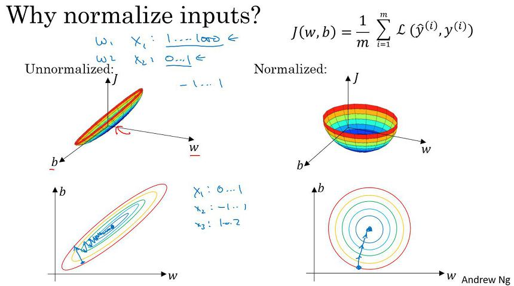
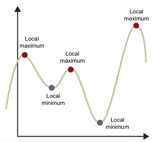

Deep Learning Study
===================

### Check out trends in deep learning 
 - <http://www.guide2research.com/topconf/>

### Data Normalize
내가 주로 이용하는 image data는 pixel map을 구성하는 각각의 pixel은 0 ~ 255 사이 값을 가진다. 
이를 255로 나누어 주면 0 ~ 1사이 값들로 구성되게 된다.

위 이미지에서 보이는 것처럼 Unnormalized data는 학습하는 과정이 매우 복잡하고 길다.
단순하게 생각해도 값이 0 ~ 255 사이 값이니까.

Normalize를 적용해주면 0 ~ 1사이 값이니 학습이 간결해지고, 추가적으로 **local optimum** 에빠지게 될 가능성도 줄이는 효과가 있다.

