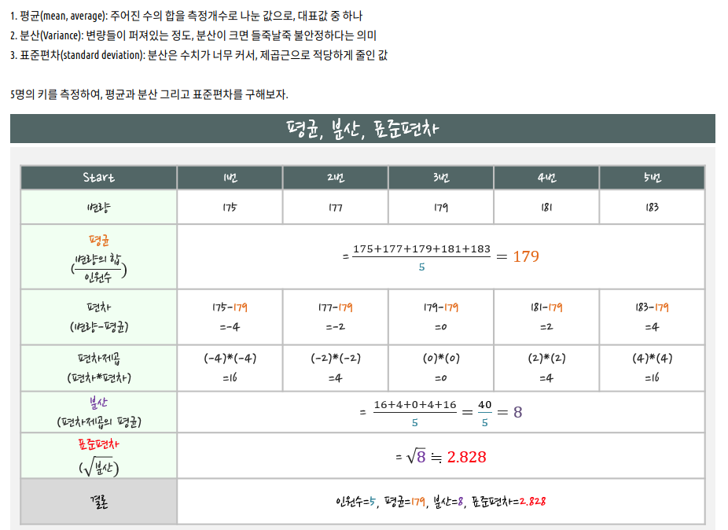
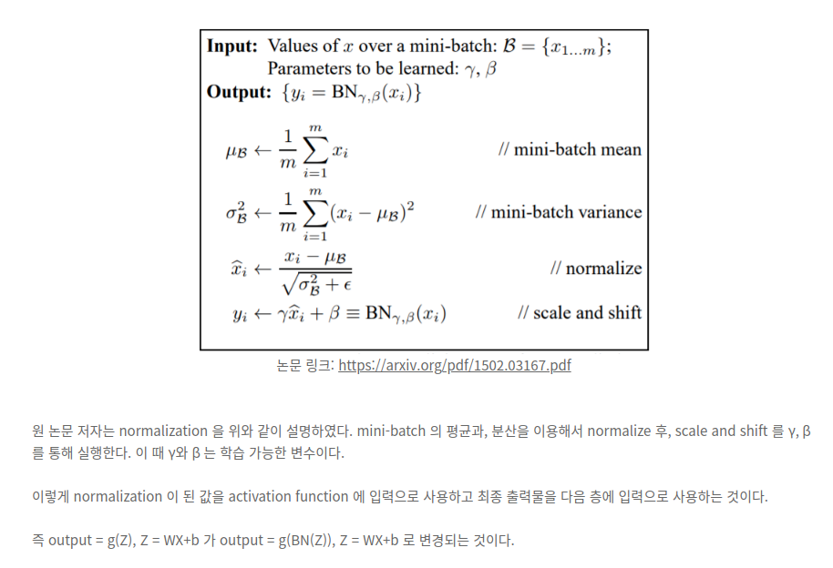
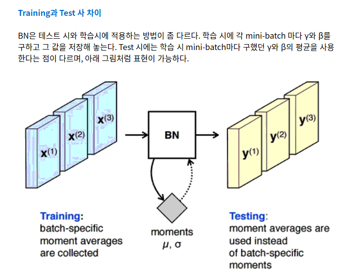

Deep Learning Study
===================

## Check out trends in deep learning 
 - <http://www.guide2research.com/topconf/>
 
## ML, DL LECTURES
- [CS230 2018 Fall Season Lecture](http://cs230.stanford.edu/lecture/)

- [cs231 2019 spring Season Lecture](http://cs231n.github.io/)

- [모두의 딥러닝 시즌2](https://deeplearningzerotoall.github.io/season2/)

## Mathematics
딥러닝을 하면서 필요한 수학적인 개념들을 정리해 보았다.

첫번째로 평균(mean), 분산(variance), 편차(deviation), 표준편차(standard deviation) 이다.

참조 - [LearnX 통계 블로그](https://learnx.tistory.com/entry/%ED%86%B5%EA%B3%84%EC%9D%98-%EA%B8%B0%EC%B4%88%EC%9D%B8-%ED%8F%89%EA%B7%A0-%EB%B6%84%EC%82%B0-%ED%91%9C%EC%A4%80%ED%8E%B8%EC%B0%A8)

### Data Normalize
내가 주로 이용하는 image data는 pixel map을 구성하는 각각의 pixel은 0 ~ 255 사이 값을 가진다. 
이를 255로 나누어 주면 0 ~ 1사이 값들로 구성되게 된다.

위 이미지에서 보이는 것처럼 Unnormalized data는 학습하는 과정이 매우 복잡하고 길다.
단순하게 생각해도 값이 0 ~ 255 사이 값이니까.

Normalize를 적용해주면 0 ~ 1사이 값이니 학습이 간결해지고, 추가적으로 **local optimum**에 빠지게 될 가능성도 줄이는 효과가 있다.

### Batch Normalization
mini-batch(X1 ~ Xm) 단위로 normalization을 실행하는데, 이에 대한 평균과 분산을 구하여 **normalize**하고,
gamma와 beta 값을 통해 **scale and shift**한다.

추가로 Batch Normalization은 train, test 각각 동작 방식이 조금 다르다.
train을 할때는 mini-batch마다 gamma와 beta를 구하고 그 값을 저장해 둔다.
test때는 학습시 mini-batch마다 구했던 gamma와 beta의 평균을 사용한다.

마지막으로 CNN에 Batch Normalization을 적용하는 방식은 조금 다르다. 
conv2d layer에서 activation function에 입력되기 전에 WX+b로 weight가 적용되었을 때, b의 역할을 Beta가 완벽히 대신 할 수 있기 때문에 b를 삭제한다.

또한, CNN의 경우 convolution의 성질을 유지시키고 싶기 때문에, 각 channel을 기준으로 각각의 γ, β 를 만든다. 
 예를 들어 mini-batch size 가 m, channel size 가 n 인 Convolution Layer에서 Batch Normalization을 적용하면,
 convolution을 적용한 후의 feature map의 사이즈가 p x q 일 경우, 
 각 channel 에 대해 m x p x q 개의 스칼라 값(즉, n x m x p x q 개의 스칼라 값)에 대해 평균과 분산을 구한다.) 
 최종적으로 γ, β 는 각 channel 에 대해 한개 씩, 총 n개의 독립적인 Batch Normalization 변수쌍이 생기게 된다.

## BN의 문제점
https://subinium.github.io/introduction-to-normalization/

