# Blog
[https://www.notion.so/pervin0527/932d8e6e02b243f5991078c7f890c479](https://www.notion.so/pervin0527/932d8e6e02b243f5991078c7f890c479)

# 🛰Environment
- Ubuntu - 18.04
- Docker - 19.03
- Tensorflow - 2.3 (2020.09 UPDATED!!!)
- Python - 3.6.9
- OpenCV-python - 4.1.1
         

# 🚀My Projects

## 🏗[Tensorflow 2.x](https://github.com/pervin0527/pervinco/blob/master/docs/Tensorflow_tutorial.md)  
   1. tf.data API Tutorial
      - [Blog Post 1](https://www.notion.so/pervin0527/Tensorflow-data-API-1-208ddce5837744fa8b0d9b14b30e6dd2)
      - [Blog Post 2](https://www.notion.so/pervin0527/Tensorflow-data-API-2-6e481e1285df4366813548a2dabe1b9f)
      - [Jupyter-notebook Tutorial](https://gist.github.com/pervin0527/e9af4e0faab83243cb7f26990cac77f8)

   2. tfrecord 생성
      - [Blog Post](https://www.notion.so/pervin0527/TFrecord-962fb914b74a47739b66e9e773e4817b)
      - [Source Code - feature를 csv파일에 작성하기](https://github.com/pervin0527/pervinco/blob/master/source/features_to_csv.py)
      - [Source Code - csv파일로 tfrecord파일 생성하기](https://github.com/pervin0527/pervinco/blob/master/source/generate_tfrecords.py)

## 🚁[Image Dataset Augmentation](https://github.com/pervin0527/pervinco/blob/master/docs/Image_Dataset_Augmentation.md)

   ### 1. Albumentations

   
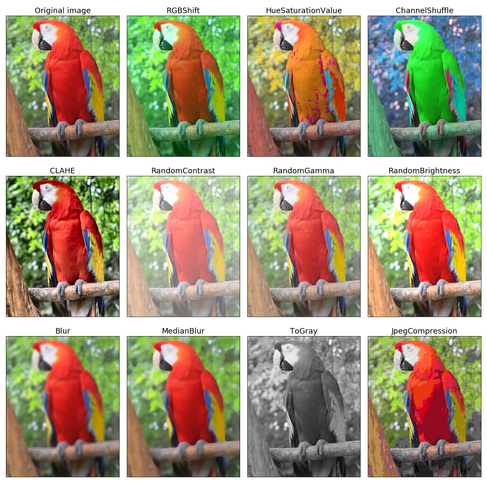

   - [Blog Post](https://www.notion.so/pervin0527/Albumentation-540221895eb04681969a43ee6d8acf71)

   ### 2. Image classification dataset에 Augmentation 적용하기

   <table border="0">
   <tr>
      <td>
      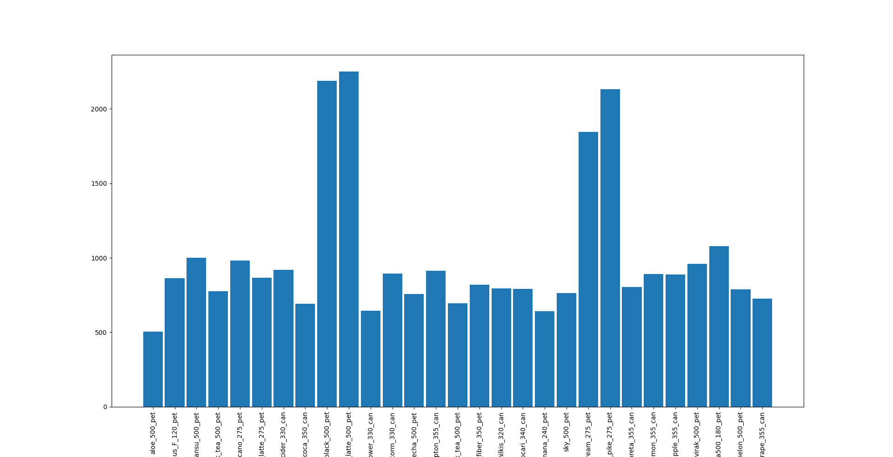
      </td>
      <td>
      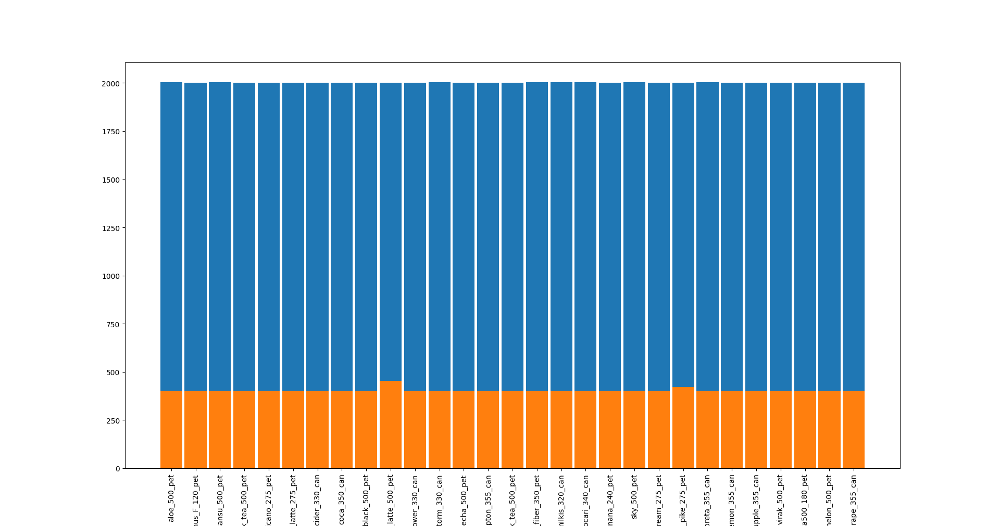
      </td>
   </tr>
   </table>  

   - [Blog Post](https://www.notion.so/pervin0527/Augmentation-pipeline-for-image-classification-4932be16eb914e5892b015980efce4df)
   - [Source Code](https://github.com/pervin0527/pervinco/blob/master/source/classification_data_augmentation.py)

         python3 classification_data_augmentation.py \
         --input_images_path=/data/backup/pervinco_2020/datasets/test \
         --num_of_aug=1000 \
         --output_path=/data/backup/pervinco_2020/Auged_datasets/test

   ### 3. Object Detecion dataset에 Augmentation 적용하기

   <table border="0">
   <tr>
      <td>
      
      </td>
      <td>
      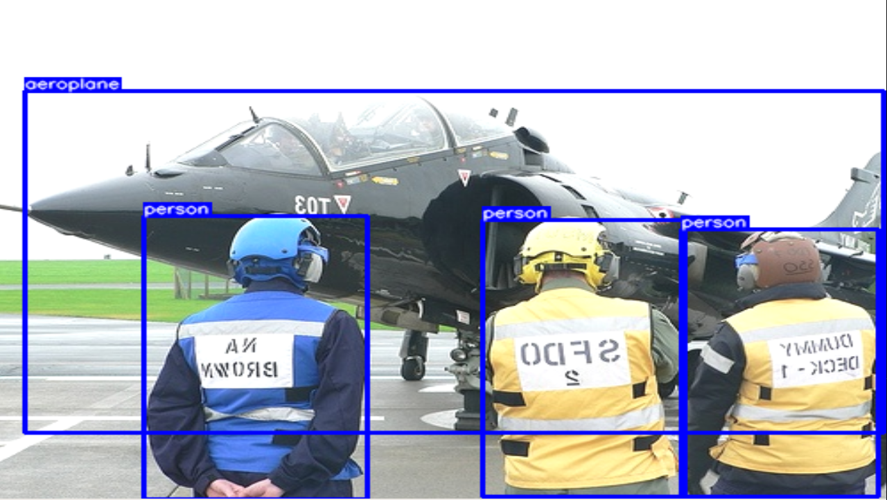
      </td>
   </tr>
   </table> 

   - [Blog Post](https://www.notion.so/pervin0527/Augmentation-pipline-for-Object-Detection-4e239d6db6eb4fe09da8b66f6af1ba4a)
   - [Source Code](https://github.com/pervin0527/pervinco/blob/master/source/detection_data_augmentation.py)  

         python3 detection_data_augmentation.py \
         --input_images_path=/data/backup/pervinco_2020/darknet/build/darknet/x64/data/obj/test/images \
         --input_xmls_path=/data/backup/pervinco_2020/darknet/build/darknet/x64/data/obj/test/xmls \
         --output_path=/data/backup/pervinco_2020/darknet/build/darknet/x64/data/obj/test/outputs \
         --output_shape=merge \
         --visual=False

## ✈[Image Classification](https://github.com/pervin0527/pervinco/blob/master/docs/image_classification.md)

   ### 1. Image 인식 개요 및 tensorflow 예제

   - [Example](http://research.sualab.com/practice/2018/01/17/image-classification-deep-learning.html)
   - [Tensorflow 2.1 simple example](https://www.kaggle.com/philculliton/a-simple-tf-2-1-notebook)

   ### 2. Image Classification + EfficientNet

   <table border="0">
      <tr>
         <td>
         
         </td>
         <td>
         
         </td>
      </tr>
      </table>

   - [Blog Post](https://www.notion.so/pervin0527/Basic-Image-Classification-using-EfficientNet-8ac30bbd2bc84d4fb494740b5c7c99c6)
   - [Source Code - Normal Training EfficientNet](https://github.com/pervin0527/pervinco/blob/master/source/tf2.3_EfficientNet_ver1.py)
   - [Source Code - Training with Augmentation(include CutMix, MixUp) EfficientNet tf2.3](https://github.com/pervin0527/pervinco/blob/master/source/tf2.3_EfficientNet.py)
      
         python3 tf2.3_EfficientNet_ver2.py --input_dataset=/path/ # input dataset path
                                            --visualize=True # tf.data visualize imshow
                                            --do_cutmix=True # apply cutmix & mixup

   - [Blog Post - Accuracy Test](https://github.com/pervin0527/pervinco/blob/master/source/tf2.3_model_test.py)
   - [Source Code - Multi GPU Training](https://github.com/pervin0527/pervinco/blob/master/source/tf2.3_Multi_gpu_training.py)

   ### 3. Multi Label Image Classification

   <table border="0">
   <tr>
      <td>
      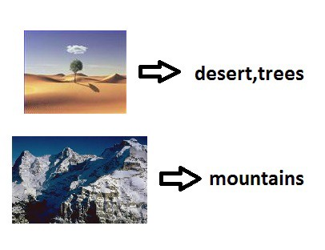
      </td>
      <td>
      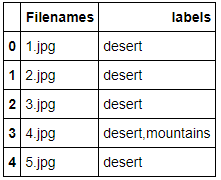
      </td>
   </tr>
   </table>

   - [Blog Post](https://www.notion.so/pervin0527/Multi-label-Classification-7a69efb0281c46cf80d2fe24e6a0f4b2)
   - [Source Code - training + tf.data](https://github.com/pervin0527/pervinco/blob/master/source/tf2.3_multi_label_classification.py)
   - [Source Code - Accuracy Test](https://github.com/pervin0527/pervinco/blob/master/source/tf2.3_multi_label_predict.py)

   ### 4. K-Fold Cross Validation & Ensemble
   

   
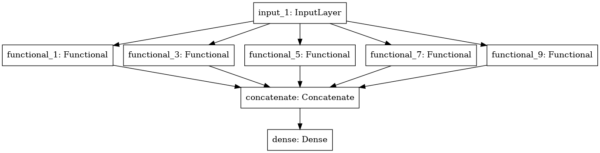

   
   - [Source Code](https://github.com/pervin0527/pervinco/blob/master/source/landmark_classification/k_fold_train.py)

   ### 5. CutMix & MixUp Augmentation & K-Fold Cross Validation Training
   
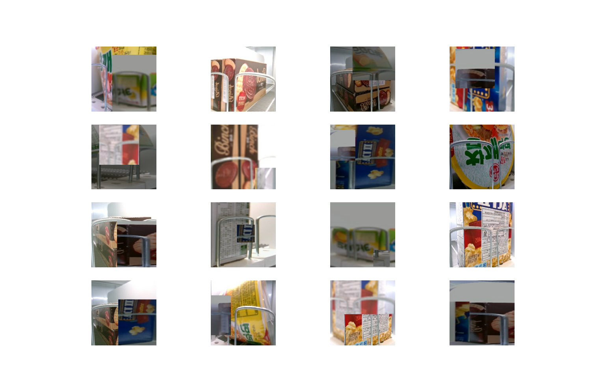

   
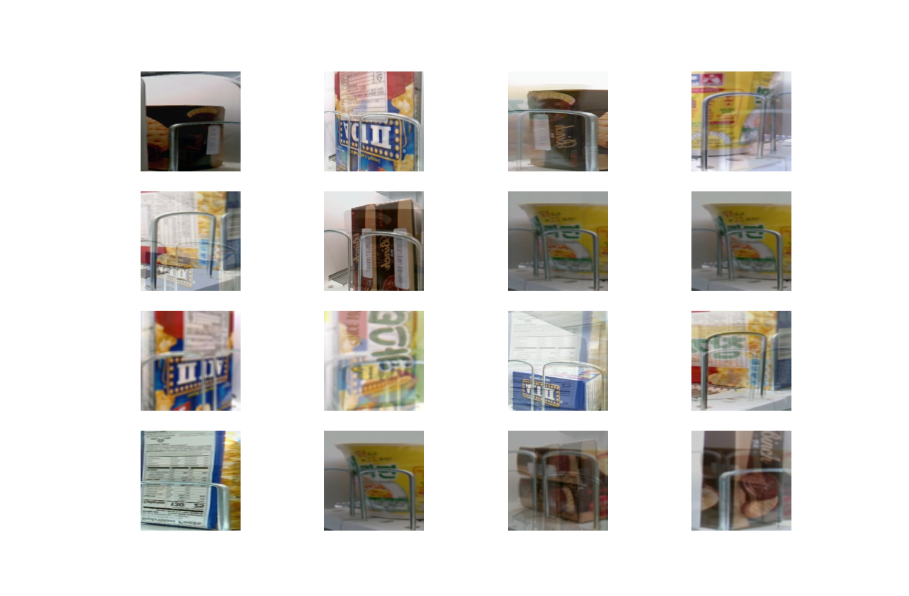

   
   - [Source Code](https://github.com/pervin0527/pervinco/blob/master/source/tf2.3_EfficientNet.py)
      
         python3 tf2.3_Efficient_Net.py --input_dataset=/path/ --do_cutmix=True

   - [Source Code](https://github.com/pervin0527/pervinco/blob/master/source/cut_mix_training.py)

## 🚝[Object Detection](https://github.com/pervin0527/pervinco/blob/master/docs/Object_Detection.md)  
   ### 1. Tensorflow Object Detection API 소개 및 사용방법
   
   

   
   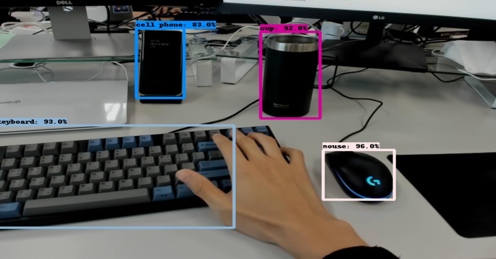

   - [Blog Post](https://www.notion.so/pervin0527/Tensorflow-2-Object-Detection-API-a354ee337107497dae8bcbde7341e2a8)
   - [Source Code - Test image inference](https://github.com/pervin0527/pervinco/blob/master/source/tensorflow_object_detection/tf2_object_detection_image_inference.py)
   - [Source Code - Test Video inference](https://github.com/pervin0527/pervinco/blob/master/source/tensorflow_object_detection/tf2_object_detection_video_inference.py)

   ### 2. Yolo V4

   

   -  [Blog Post](https://www.notion.so/pervin0527/YOLO-v4-d7d9a312e4b14005be22f393539b85cd)
   - [Source Code - Test image inference](https://github.com/pervin0527/pervinco/blob/master/source/yolov4/yolov4_image_inference.py)
   - [Source Code - Test Video inference](https://github.com/pervin0527/pervinco/blob/master/source/yolov4/video_inference.py)

   ### 3. Google/Automl - EfficientDet

   

   - [Blog Post](https://www.notion.so/pervin0527/EfficientDet-Google-AutoML-efc3927f229448759973322756c3bd23)

## 2020.11.16 [Dacon - Landmark Classification Competition]
   **We were able to get a score of 99.085 and finished 26th in 387 teams.**
   - [Blog Post](https://www.notion.so/pervin0527/Dacon-Landmark-Classification-6f1d5f42a2db43e6aa45e03077f23692)
   

   

## InterMinds Projects
  1. Smart checkout table - 2019.05 ~ 2019.12 Fin.  
   
      - [Blog Post](https://www.notion.so/pervin0527/InterMinds-Smart-Checkout-Table-5c8bd2acc4b246eda8193a90bb8066f9)
      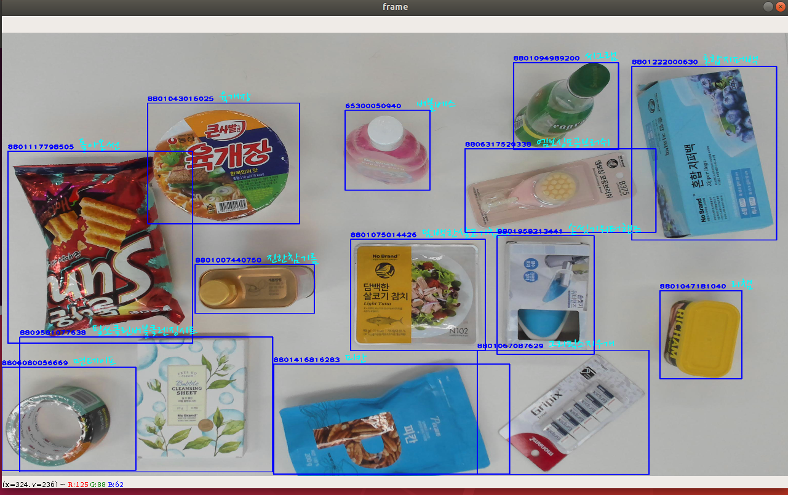

  2. Smart Shelf - 2020.01 ~ 2020.08 Fin.
   
      - [Blog Post](https://www.notion.so/pervin0527/Interminds-Smart-Cabinet-c13f8aa64c144ebf8ead49506e0359d3)
      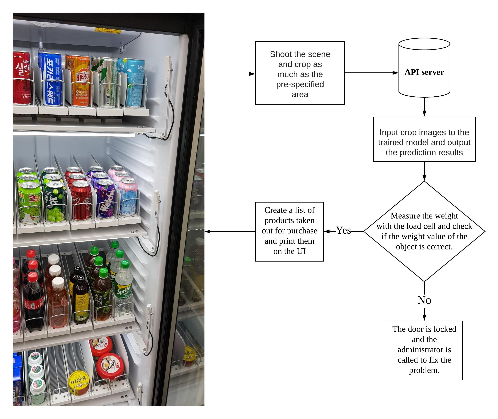
   