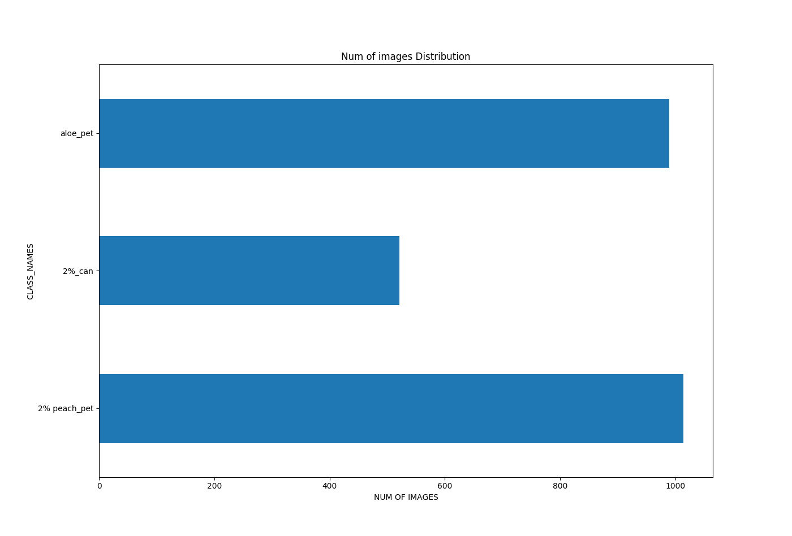
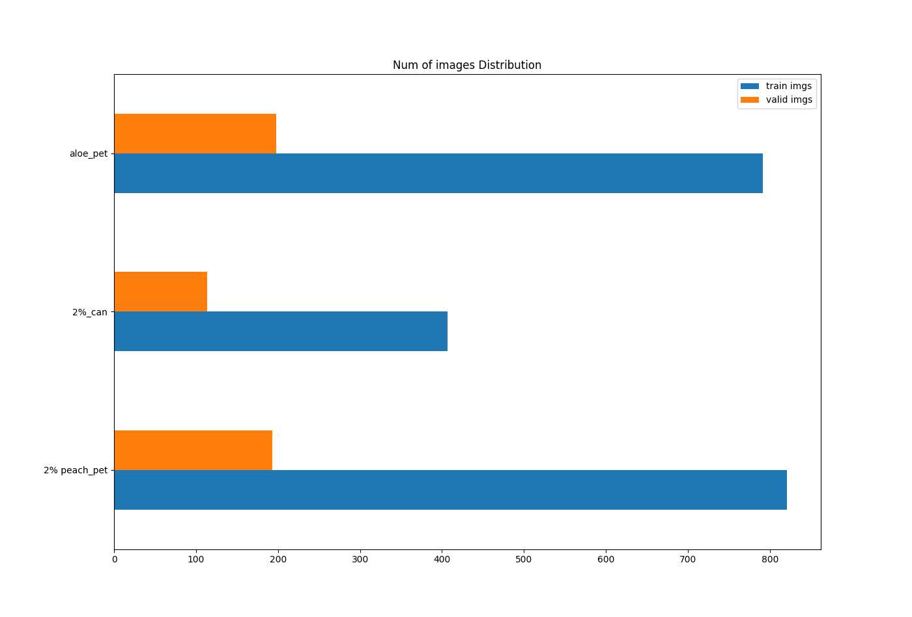
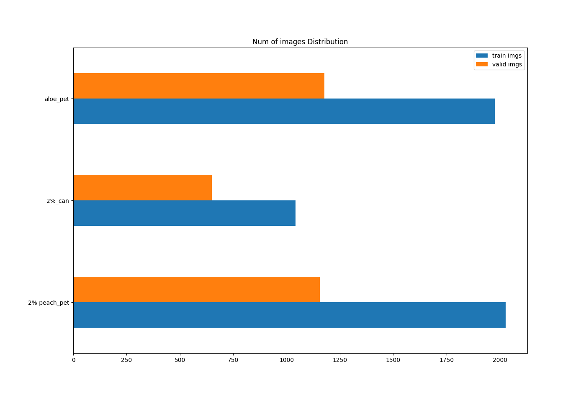
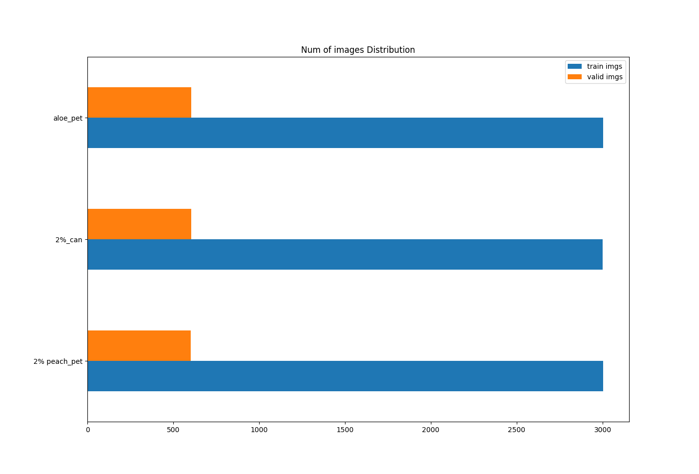
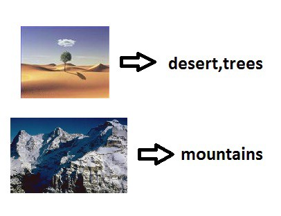
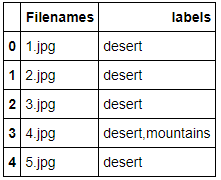

# Environment + Installation
 - Using Docker-Tensorflow  
  
   1. [Docker(Version : 19.03.11) Install Guide](https://pervin0527.github.io/docker/)
   2. [Tensorflow Docker](https://www.tensorflow.org/install/docker?hl=ko)
   3. [Docker Hub Tensorflow](https://hub.docker.com/r/tensorflow/tensorflow/)
   4. Install Tensorflow 2.1-gpu-py3-jupyter  
   
          docker pull tensorflow/tensorflow:2.1.0-gpu-py3-jupyter

 - opencv-python
 
        pip install opencv-python
         
 - Keras
        
        pip install keras==2.3.1

# Projects

## 1. ImageClassification using Tensorflow & Keras

   <table border="0">
   <tr>
      <td>
      
      </td>
      <td>
      
      </td>
   </tr>
   </table>

   - Concept
      - [About image recognition](http://research.sualab.com/introduction/2017/11/29/image-recognition-overview-1.html)
      - [Example inference](http://research.sualab.com/practice/2018/01/17/image-classification-deep-learning.html)

   - Tensorflow
      - [Tensorflow tutorial](https://github.com/pervin0527/pervinco/blob/master/tensorflow_tutorial.md)
      - [Tensorflow 2.1 simple example](https://www.kaggle.com/philculliton/a-simple-tf-2-1-notebook)

   - Source Code
     - [ResNet with Keras Imagedatagenerator](https://github.com/pervin0527/pervinco/blob/master/source/keras_resnet50_train.py)
     - EfficientNet [https://github.com/qubvel/efficientnet](https://github.com/qubvel/efficientnet)
     
     

         sudo pip3 install -U git+https://github.com/qubvel/efficientnet
    
      import EfficientNet

         import efficientnet.keras as efn

        or  

         from efficientnet.tfkeras import EfficientNetB0, preprocess_input

      - 2020.06.08 UPDATE
        - EfficientNet **Noisy Student** weights [released](https://www.kaggle.com/c/bengaliai-cv19/discussion/132894)

              import efficientnet.keras as eff
              model = eff.EfficientNetB0(weights='noisy-student')

     - [EfficientNet with tf.data](https://github.com/pervin0527/pervinco/blob/master/source/Efnet_tf_data_train.py)
     - **2020.06.11 UPDATE**
       - [Learning Rate Schedule Callback function Added](https://github.com/pervin0527/pervinco/blob/05ba90f7a1921ddc84c79f3be8c232119de0b0e6/source/Efnet_tf_data_train.py#L147)
     - [Test with Model](https://github.com/pervin0527/pervinco/blob/master/source/tf2_model_test.py)
     - **2020. 06.29 UPDATE**
       - [EfficientNet Train with Multi_GPU](https://github.com/pervin0527/pervinco/blob/master/source/Efnet_multi_gpu_train.py)
     
 
## 2. Google Automl/EfficientDet    
   - [Automl/EfficientDet GitHub](https://github.com/google/automl/tree/master/efficientdet)
    
   

  
   
   - Blog post  
     1. [Install, Pretrained_Inference, Train](https://pervin0527.github.io/efficientdet/)  
     2. [Train model inference](https://pervin0527.github.io/efficientdet2/)

## 3. Image Dataset Augmentation
   - Keras ImageDataGenerator  
     - [Tensorflow API - Generate batches of tensor image data with real-time data augmentation.](https://www.tensorflow.org/api_docs/python/tf/keras/preprocessing/image/ImageDataGenerator?version=nightly)

     - [Source Code - keras_img_aug.py](https://github.com/pervin0527/pervinco/blob/master/source/keras_img_aug.py)
    
   - Albumentation  
    
       

      - [Albumentations Git_Repo](https://github.com/albumentations-team/albumentations)
      - [Albumentations API ](https://albumentations.readthedocs.io/en/latest/api/augmentations.html#module-albumentations.augmentations.functional)
      - [Source Code - albumentation_aug1.py](https://github.com/pervin0527/pervinco/blob/master/source/albumentation_aug1.py)  
          - Augmentation is performed by using a loop on each image in the class.

          - Before applying augmentation.  number of seed images
            
          

          - After applying augmentation.
           

      -  [Source Code - albumentation_aug2.py](https://github.com/pervin0527/pervinco/blob/master/source/albumentation_aug2.py)  
          - The number of images in classes are same as the number entered by the user.
              
    
      - Note
          - [What does mean p??](https://github.com/albumentations-team/albumentations/issues/586#issue-596422426)

          - [What is CLAHE?](https://opencv-python.readthedocs.io/en/latest/doc/20.imageHistogramEqualization/imageHistogramEqualization.html#clahe-contrast-limited-adaptive-histogram-equalization)
  
      -  Performance
         Augmentation options
         - Shift (limit=0.2)
         - Rotate (range=360)

         Tools | 100 augmented images per sec
         ----- | ------------
         Keras Aug | 0.02068s
         Albumentation | 0.00211s

         Albumentation is 9.8 times faster than Keras_augmentation.

## 4. Model Ensemble
   - [Blog post](https://pervin0527.github.io/ensemble/)
   - [Tensorflow keras Ensemble](https://www.tensorflow.org/guide/keras/functional)
   - [Source Code](https://github.com/pervin0527/pervinco/blob/master/source/assemble_train.py)

## 5. Multi Label ImageClassification

   <table border="0">
   <tr>
      <td>
      
      </td>
      <td>
      
      </td>
   </tr>
   </table>

  - [Blog post](https://pervin0527.github.io/multilabelclassification/)
  - [Reference](https://www.analyticsvidhya.com/blog/2019/04/build-first-multi-label-image-classification-model-python/)
  - Source Code  
     - [Training](https://github.com/pervin0527/pervinco/blob/master/source/multi_label_train.py)  
     - [Predict](https://github.com/pervin0527/pervinco/blob/master/source/tf2_multi_label_predict.py)  
     - [Using tf.data training](https://github.com/pervin0527/pervinco/blob/master/source/tf2_multi_label_classification.py)

## 6. Tensorflow 2.x tf.data
   - [Blog post](https://pervin0527.github.io/tf2-data/)
   - [Tutorial](https://gist.github.com/pervin0527/e9af4e0faab83243cb7f26990cac77f8)  
   - [Source Code](https://github.com/pervin0527/pervinco/blob/master/source/tf2_image_classification.py)
   - [Multi-label classification](https://pervin0527.github.io/tf2-data2/)

## 7. Plant_pathology from Kaggle

   

   - [Official](https://www.kaggle.com/tarunpaparaju/plant-pathology-2020-eda-models/)
   - [Custom Training](https://github.com/pervin0527/pervinco/blob/master/source/plant_pathology_2020.ipynb)
   - Image data 분석에 좋은 예제
   - Visualization에 대한 참고
   - Dataset 구성에 따른 Tensorflow 적용 

## 8. Yolo v4

   

   - [Official](https://github.com/AlexeyAB/darknet)
     - [Requirements](https://github.com/AlexeyAB/darknet#requirements)
     - [Compile using make](https://github.com/AlexeyAB/darknet#how-to-compile-on-linux-using-make)
     - Demo  
    
           ./darknet detector test cfg/coco.data cfg/yolov4.cfg yolov4.weights -thresh 0.25

     - [How to Train](https://github.com/AlexeyAB/darknet#how-to-train-to-detect-your-custom-objects)

  - [Blog post + Codes](https://pervin0527.github.io/YOLOv4/)

# Resource
  - Open Datasets
     - 유명한 공개 데이터 저장소
         - UC 얼바인(Irvine) 머신러닝 저장소(http://archive.ics.uci.edu/ml))
         - 캐글(Kaggle) 데이터셋(http://www.kaggle.com/datasets)
         - 아마존 AWS 데이터셋(https://registry.opendata.aws)

     - 메타 포털(공개 데이터 저장소가 나열되어 있다.)
         - 데이터 포털(Data Portals)(http://dataportals.org)
         - 오픈 데이터 모니터(Open Data Monitor)(http://opendatamonitor.eu)
         - 퀀들(Quandl)(http://quandl.com)

     - 인기 있는 공개 데이터 저장소가 나열되어 있는 다른 페이지
         - 위키백과 머신러닝 데이터셋 목록(https://en.wikipedia.org/wiki/List_of_datasets_for_machine-learning_research)
         - Quora.com(https://homl.info/10)
         - 데이터셋 서브레딧(subreddit)(http://www.reddit.com/r/datasets)
         - awesome-public-datasets(https://github.com/awesomedata/awesome-public-datasets#agriculture)
  
 - [Reference](https://github.com/pervin0527/pervinco/blob/master/reference.md)
 - [Tensorflow Guide Book](https://github.com/pervin0527/pervinco/blob/master/tensorflow_tutorial.md)

# Hands on Machine-Learning 2
   - [Chapter 1](https://github.com/pervin0527/pervinco/blob/master/hands_on_ml_2/chapter1.ipynb)
   - [Chapter 2](https://github.com/pervin0527/pervinco/blob/master/hands_on_ml_2/chapter2.ipynb)

# InterMinds Projects
  1. [Smart Checkout Table](https://pervin0527.github.io/SCO/) - 2019.05 ~ 2019.12 Fin.
  2. Smart Shelf - 2020.01 ~ This project is currently in progress.

# [Reference](https://github.com/pervin0527/pervinco/blob/master/reference.md)