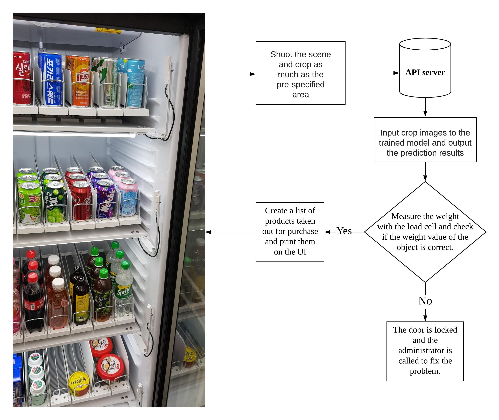

# Environment + Installation
## 🛰Environment
---

- Ubuntu - 18.04
- Docker - 19.03
- Tensorflow - 2.3 (2020.09 UPDATED!!!)
- Python - 3.6.9
- OpenCV-python - 4.1.1
         

# My Projects
- [Tensorflow Tutorials](https://github.com/pervin0527/pervinco/blob/master/docs/Tensorflow_tutorial.md)
- [Image Dataset Augmentation](https://github.com/pervin0527/pervinco/blob/master/docs/Image_Dataset_Augmentation.md)
- [Image Classification](https://github.com/pervin0527/pervinco/blob/master/docs/image_classification.md)
- [Object Detection](https://github.com/pervin0527/pervinco/blob/master/docs/Object_Detection.md)

# InterMinds Projects
  1. Smart checkout table - 2019.05 ~ 2019.12 Fin.  
   
      [Blog](https://www.notion.so/pervin0527/InterMinds-Smart-Checkout-Table-5c8bd2acc4b246eda8193a90bb8066f9)
      

  2. Smart Shelf - 2020.01 ~ 2020.08 Fin.
   
      [Blog](https://www.notion.so/pervin0527/Interminds-Smart-Cabinet-c13f8aa64c144ebf8ead49506e0359d3)
      
   