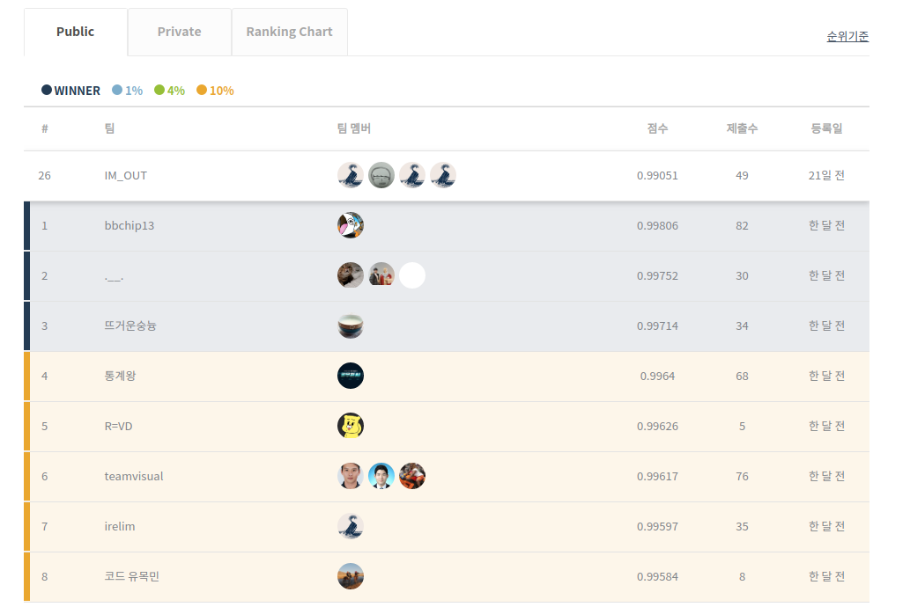
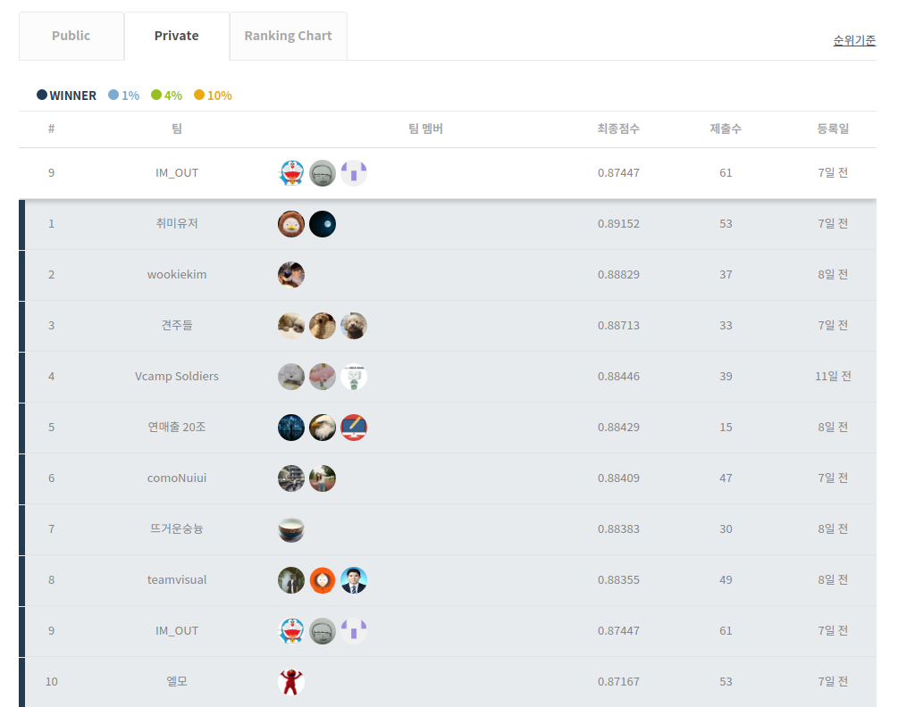

### 2020.11.16 [Dacon - Landmark Classification Competition]
   **We were able to get a score of 99.085 and finished 26th in 387 teams.**
   - [Blog Post](https://www.notion.so/pervin0527/Dacon-Landmark-Classification-6f1d5f42a2db43e6aa45e03077f23692)
   

### 2021.03.01 [Dacon - Dirty Mnist Multi label classificatin]
   **We were able to get a score of 87.44 and finished 10th in 780 teams.**
   - [Blog Post](https://www.notion.so/pervin0527/Dacon-Dirty-mnist-Multi-Label-Classification-10th-780teams-21880a4b0b7442bab06e6a1dea7cdce6)
   

