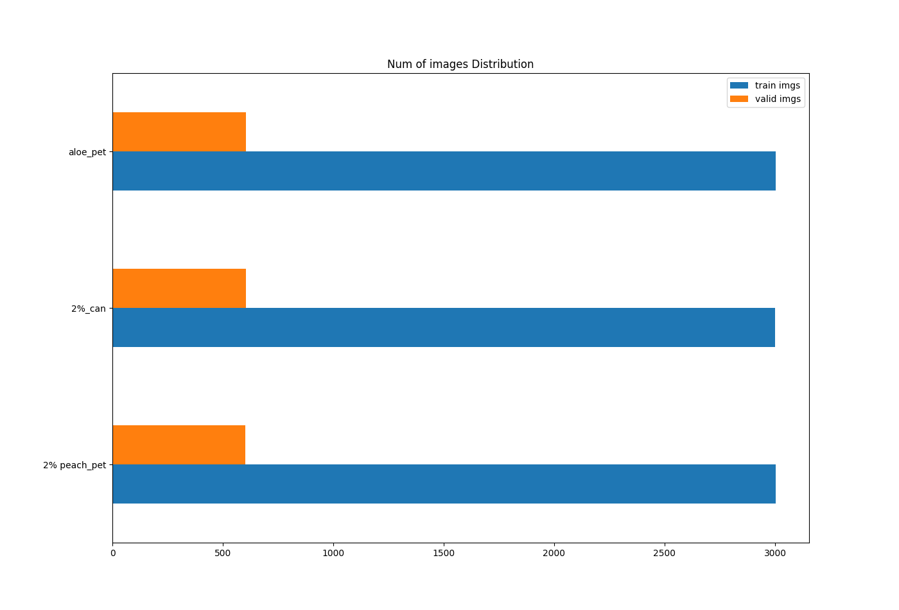

## 1. Image Dataset Augmentation
   - ## Albumentation
     1. **[Albumentations Git_hub](https://github.com/albumentations-team/albumentations)**
     2. **[Albumentations API](https://albumentations.readthedocs.io/en/latest/api/augmentations.html#module-albumentations.augmentations.functional)**
  
   - ### ImageClassification
   
     

       
     - **UPDATED 2020.06.29**
       - [CODE](https://github.com/pervin0527/pervinco/blob/master/source/albumentation_aug4.py)
       - The number of images in classes are same as the number entered by the user.
       

  
    
   - ### Object Detection
  
      <table border="0">
      <tr>
         <td>
         
         </td>
         <td>
         
         </td>
      </tr>
      </table> 

      -  Augmentation for VOC PASCAL dataset.
      -  Save the augmented image and xml file.

      - **UPDATED 2020.07.21**
        - [CODE](https://github.com/pervin0527/pervinco/blob/master/source/albumentation_voc_aug2.py)
        - Same function as version 1, but the code has been changed. Both versions are available.

                  python3 albumentation_voc_aug.py \
                  ./VOC2012/JPEGImages \     # Image dataset path
                  ./VOC2012/Annotations \    # Annotation dataset path 
                  ./VOC2012/Augmentations    # Path to save augmentation applied file

# Resource
  - Open Datasets
     - 유명한 공개 데이터 저장소
         - UC 얼바인(Irvine) 머신러닝 저장소(http://archive.ics.uci.edu/ml))
         - 캐글(Kaggle) 데이터셋(http://www.kaggle.com/datasets)
         - 아마존 AWS 데이터셋(https://registry.opendata.aws)

     - 메타 포털(공개 데이터 저장소가 나열되어 있다.)
         - 데이터 포털(Data Portals)(http://dataportals.org)
         - 오픈 데이터 모니터(Open Data Monitor)(http://opendatamonitor.eu)
         - 퀀들(Quandl)(http://quandl.com)

     - 인기 있는 공개 데이터 저장소가 나열되어 있는 다른 페이지
         - 위키백과 머신러닝 데이터셋 목록(https://en.wikipedia.org/wiki/List_of_datasets_for_machine-learning_research)
         - Quora.com(https://homl.info/10)
         - 데이터셋 서브레딧(subreddit)(http://www.reddit.com/r/datasets)
         - awesome-public-datasets(https://github.com/awesomedata/awesome-public-datasets#agriculture)
  
 - [Reference](https://github.com/pervin0527/pervinco/blob/master/reference.md)
 - [Tensorflow Guide Book](https://github.com/pervin0527/pervinco/blob/master/tensorflow_tutorial.md)