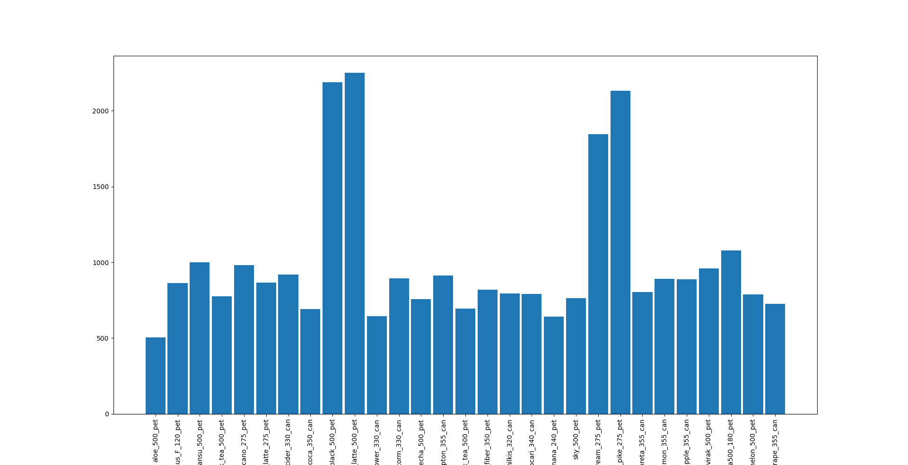
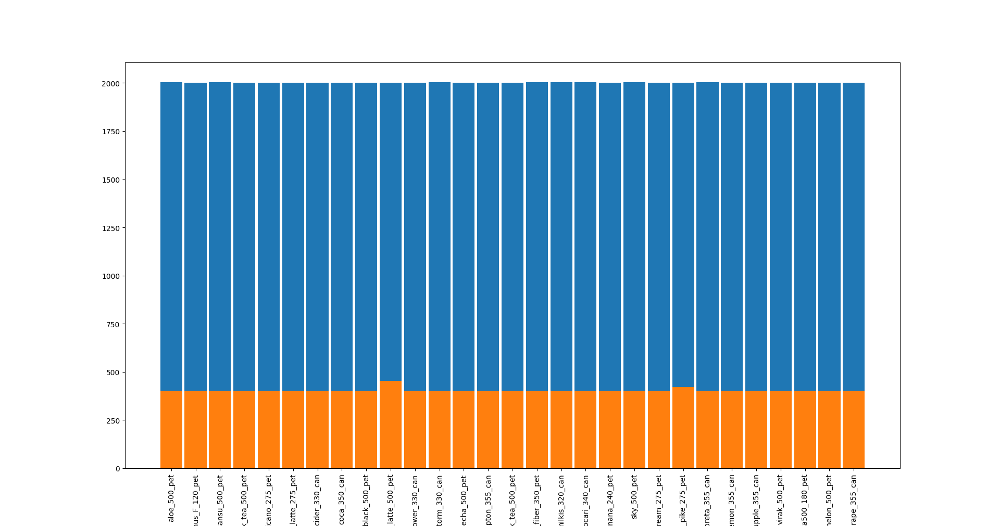
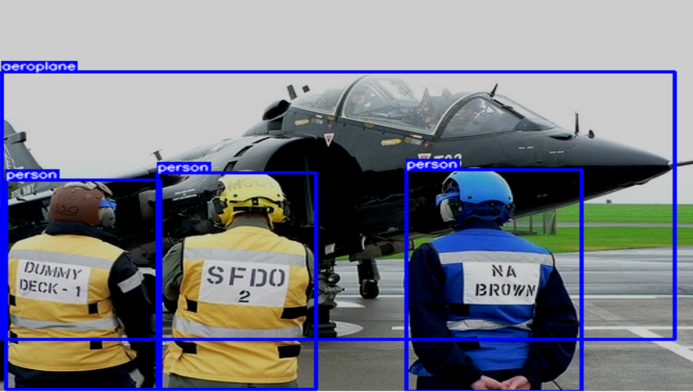

## 🚁[Image Dataset Augmentation](https://github.com/pervin0527/pervinco/blob/master/docs/Image_Dataset_Augmentation.md)

   ### 1. Albumentations

   

   - [Blog Post](https://www.notion.so/pervin0527/Albumentation-540221895eb04681969a43ee6d8acf71)

   ### 2. Image classification dataset에 Augmentation 적용하기

   <table border="0">
   <tr>
      <td>
      
      </td>
      <td>
      
      </td>
   </tr>
   </table>  

   - [Blog Post](https://www.notion.so/pervin0527/Augmentation-pipeline-for-image-classification-4932be16eb914e5892b015980efce4df)
   - [Source Code](https://github.com/pervin0527/pervinco/blob/master/source/1.augmentation/classification_data_augmentation.py)

         python3 classification_data_augmentation.py \
         --input_images_path=/data/backup/pervinco_2020/datasets/test \
         --num_of_aug=1000 \
         --output_path=/data/backup/pervinco_2020/Auged_datasets/test

   ### 3. Object Detecion dataset에 Augmentation 적용하기

   <table border="0">
   <tr>
      <td>
      
      </td>
      <td>
      
      </td>
   </tr>
   </table> 

   - [Blog Post](https://www.notion.so/pervin0527/Augmentation-pipline-for-Object-Detection-4e239d6db6eb4fe09da8b66f6af1ba4a)
   - [Source Code](https://github.com/pervin0527/pervinco/blob/master/source/1.augmentation/detection_data_augmentation.py)  

         python3 detection_data_augmentation.py \
         --input_images_path=/data/backup/pervinco_2020/darknet/build/darknet/x64/data/obj/test/images \
         --input_xmls_path=/data/backup/pervinco_2020/darknet/build/darknet/x64/data/obj/test/xmls \
         --output_path=/data/backup/pervinco_2020/darknet/build/darknet/x64/data/obj/test/outputs \
         --output_shape=merge \
         --visual=False