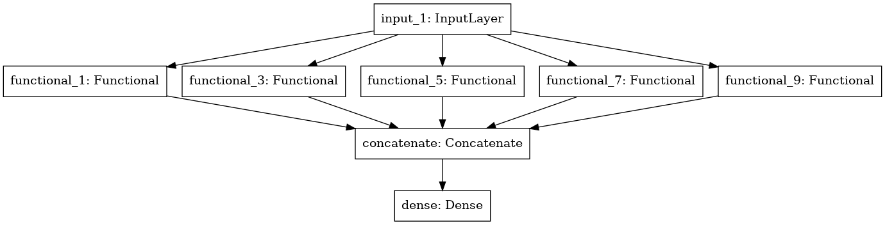

# ✈[Image Classification]

   ## 1. Image 인식 개요 및 tensorflow 예제

   - [Example](http://research.sualab.com/practice/2018/01/17/image-classification-deep-learning.html)
   - [Tensorflow 2.1 simple example](https://www.kaggle.com/philculliton/a-simple-tf-2-1-notebook)

   ## 2. Image Classification + EfficientNet

   <table border="0">
      <tr>
         <td>
         
         </td>
         <td>
         
         </td>
      </tr>
      </table>

   - [Blog Post](https://www.notion.so/pervin0527/Basic-Image-Classification-using-EfficientNet-8ac30bbd2bc84d4fb494740b5c7c99c6)
   - [Source Code - Normal Training EfficientNet](https://github.com/pervin0527/pervinco/blob/master/source/2.image_classification/tf2_EfficientNet_ver1.py)
   - [Source Code - Training with Augmentation(include CutMix, MixUp) EfficientNet tf2](https://github.com/pervin0527/pervinco/blob/master/source/2.image_classification/tf2_EfficientNet_ver2.py)
      
         python3 tf2_EfficientNet_ver2.py --input_dataset=/path/ # input dataset path
                                            --visualize=True # tf.data visualize imshow
                                            --do_cutmix=True # apply cutmix & mixup

   - [Blog Post - Accuracy Test](https://github.com/pervin0527/pervinco/blob/master/source/2.image_classification/tf2_model_test.py) - Test data can be evaluated faster in the form of tf.data.
   - [Source Code - Multi GPU Training](https://github.com/pervin0527/pervinco/blob/master/source/2.image_classification/tf2_Multi_gpu_training.py)

   ### 3. Multi Label Image Classification

   <table border="0">
   <tr>
      <td>
      
      </td>
      <td>
      
      </td>
   </tr>
   </table>

   - [Blog Post](https://www.notion.so/pervin0527/Multi-label-Classification-7a69efb0281c46cf80d2fe24e6a0f4b2)
   - [Source Code - training + tf.data](https://github.com/pervin0527/pervinco/blob/master/source/2.image_classification/tf2_multi_label_classification.py)
   - [Source Code - Accuracy Test](https://github.com/pervin0527/pervinco/blob/master/source/2.image_classification/tf2_multi_label_predict.py)

   ## 4. K-Fold Cross Validation & Ensemble
   

   

   
   - [Source Code](https://github.com/pervin0527/pervinco/blob/master/source/4.competitions/landmark_classification/k_fold_train.py)

   ## 5. CutMix & MixUp Augmentation & K-Fold Cross Validation Training
   

   

   
   - [Source Code](https://github.com/pervin0527/pervinco/blob/master/source/2.image_classification/tf2_EfficientNet_ver2.py)

      augmentation(using albumentations) + cutmix + mixup
      
         python3 tf2_Efficient_Net_ver2.py --input_dataset=/path/ --do_cutmix=True

   - [Source Code](https://github.com/pervin0527/pervinco/blob/master/source/2.image_classification/tf2_cut_mix_training.py)

      cutmix + mixup
      
         python3 tf2_cut_mix_training.py