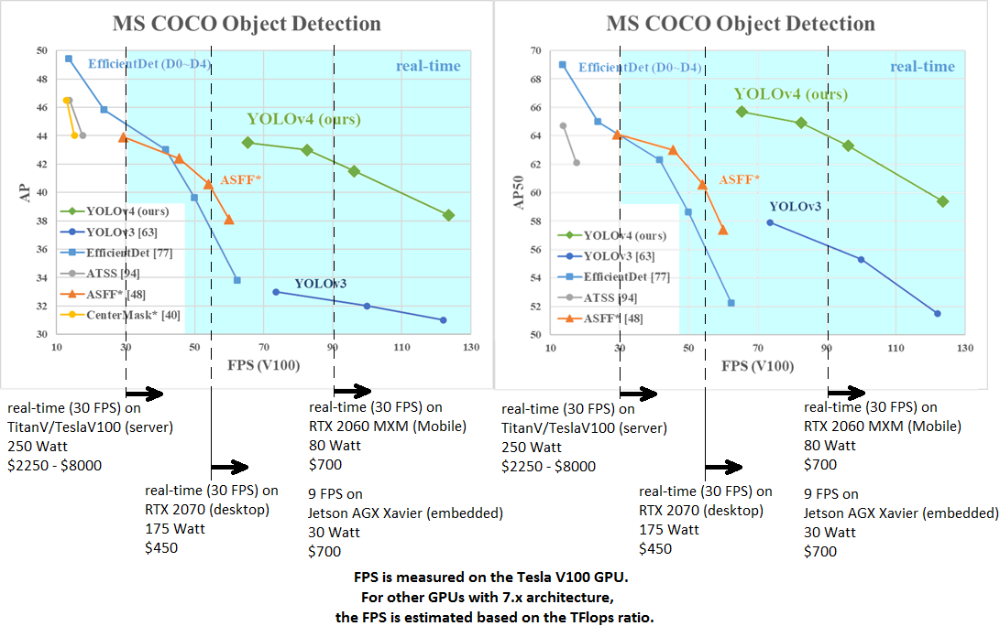

# 🚝[Object Detection](https://github.com/pervin0527/pervinco/blob/master/docs/Object_Detection.md)  
   ## 1. Tensorflow Object Detection API 소개 및 사용방법
   
   

   
   

   - [Blog Post](https://www.notion.so/pervin0527/Tensorflow-2-Object-Detection-API-a354ee337107497dae8bcbde7341e2a8)
   - [Source Code - Test image inference](https://github.com/pervin0527/pervinco/blob/master/source/3.object_detection/tensorflow_object_detection/tf2_object_detection_image_inference.py)
   - [Source Code - Test Video inference](https://github.com/pervin0527/pervinco/blob/master/source/3.object_detection/tensorflow_object_detection/tf2_object_detection_video_inference.py)

   ## 2. Yolo V4

   

   -  [Blog Post](https://www.notion.so/pervin0527/YOLO-v4-d7d9a312e4b14005be22f393539b85cd)
   - [Source Code - Test image inference](https://github.com/pervin0527/pervinco/blob/master/source/3.object_detection/yolov4/yolov4_image_inference.py)
   - [Source Code - Test Video inference](https://github.com/pervin0527/pervinco/blob/master/source/3.object_detection/yolov4/yolov4_video_inference.py)

   ## 3. Google/Automl - EfficientDet

   

   - [Blog Post](https://www.notion.so/pervin0527/EfficientDet-Google-AutoML-efc3927f229448759973322756c3bd23)