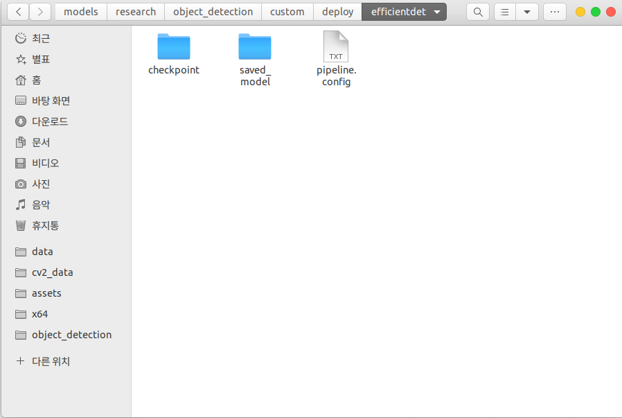

# Guide
[Tensorflow 2 Object Detection API](https://github.com/tensorflow/models/blob/master/research/object_detection/g3doc/tf2.md)

NOTE: TFLite currently only supports SSD Architectures (excluding EfficientDet) for boxes-based detection. Support for EfficientDet is provided via the TFLite Model Maker library.

The output model has the following inputs & outputs:

## change config files
[tf2 object detection model zoo](https://github.com/tensorflow/models/blob/master/research/object_detection/g3doc/tf2_detection_zoo.md)

## training

    # cd tensorflow/models/research

    python3 object_detection/model_main_tf2.py \
    --pipeline_config_path=object_detection/custom/deploy/efficientdet/pipeline.config \
    --model_dir=object_detection/custom/models/21_06_09_efnet

## Tensorboard
    # cd tensorflow/models/research

    tensorboard --logdir=./object_detection/custom/models/21_06_09_efnet/train

## Convert pb, tflite

    python3 object_detection/export_tflite_graph_tf2.py
    --pipeline_config_path object_detection/custom/deploy/ssd_mobilenet_v2_320/pipeline.config 
    --trained_checkpoint_dir object_detection/custom/models/traffic_sign/21_06_14
    --output_directory object_detection/custom/models/traffic_sign/21_06_14/

    python3 convert_tflite.py

## EfficientDet

    python3 object_detection/export_tflite_graph_tf2.py \
    --pipeline_config_path object_detection/custom/deploy/efficientdet/pipeline.config \
    --trained_checkpoint_dir object_detection/custom/models/traffic_sign/21_06_17 \
    --output_directory object_detection/custom/models/traffic_sign/21_06_17 \
    --config_override="\
    model{ \
      ssd{ \
        image_resizer { \
          fixed_shape_resizer { \
            height: 512 \
            width: 512 \
          } \
        } \
      } \
    }"

## CenterNet
  if you use centernet, refer to this link  
  [https://github.com/tensorflow/models/issues/9414#issuecomment-791674050](https://github.com/tensorflow/models/issues/9414#issuecomment-791674050)

    python3 object_detection/export_tflite_graph_tf2.py \
    --pipeline_config_path object_detection/custom/deploy/centernet_resnet50_v2_512/pipeline.config \
    --trained_checkpoint_dir object_detection/custom/models/traffic_sign/21_06_18 \
    --output_directory object_detection/custom/models/traffic_sign/21_06_18 \
    --centernet_include_keypoints=false \
    --max_detections=10 \
    --config_override="\
    model{ \
      center_net{ \
        image_resizer { \
          fixed_shape_resizer { \
            height: 512 \
            width: 512 \
          } \
        } \
      } \
    }"

## Quantization

  Currently, only float type quantization is possible.

## Tensorboard in ssh
  if you train on server and want to monitor tensorboard.

  oooo : tensorboard port number  
  xxxx : ip address  
  ^^^^ : ip port

    ssh -L oooo:localhost:oooo -p ^^^^ name@xxxx.xxxx.xxxx.xxxx

    # shutdown process
    lsof -i:6006
    kill -9 PID  